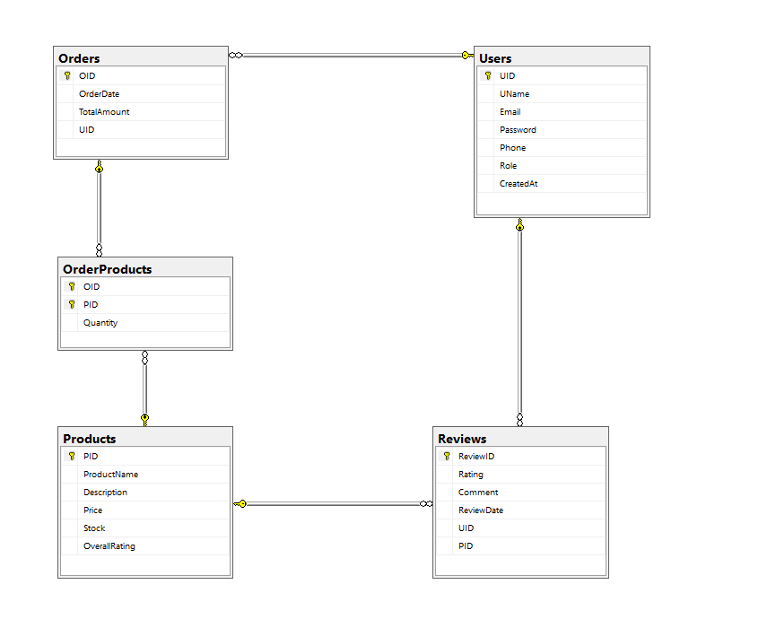

# 🛒 E-Commerce System

## 📖 Overview (For Everyone)
The **E-Commerce System** is a web-based backend application that powers online shopping platforms.  
It manages **users, products, orders, and reviews** in a secure and efficient way.

- Customers can **register, browse products, place orders, and leave reviews**.  
- Businesses can **manage products and track customer orders**.  
- The system ensures **secure login with encrypted passwords** and uses modern standards like **JWT tokens** for authentication.  

👉 In simple terms: it’s the **engine behind an online shop** — storing data, processing orders, and keeping everything safe.

---

## 👨‍💻 Project Structure (For Developers)

	E-CommerceSystem/

	┣ Controllers/ # API endpoints (Users, Products, Orders, Reviews)

	┣ DTOs/ # Data Transfer Objects for input/output

	┣ Models/ # Entity classes (User, Product, Order, OrderProducts, Review)

	┣ Repositories/ # Repository pattern for database access

	┣ Services/ # Business logic (Auth, Orders, Products, Reviews)

	┣ Data/ # ApplicationDbContext, EF migrations

	┣ Middleware/ # Error handling & auth pipeline

	┣ Program.cs # Entry point & service configuration

	┣ appsettings.json # DB connection & JWT configuration


---

## ⚙️ Tech Stack
- **.NET 8 Web API**
- **Entity Framework Core 9** (SQL Server, code-first migrations)
- **JWT Authentication** for secure login
- **BCrypt.Net** for password hashing
- **Swagger** for API documentation

---

## 📑 Features
### 👤 Users
- Register new users (securely stored with hashed passwords)
- Login with email & password → receive JWT token
- Retrieve user details by ID

### 🛍 Products
- Add, update, delete products
- List products (supports pagination)
- Search by product ID

### 📦 Orders
- Place an order (calculates total, deducts stock)
- View all orders for logged-in user
- Get details of a specific order

### ⭐ Reviews
- Add reviews to products
- Update or delete reviews
- View all reviews for a product

---

## 🔐 Security
- **JWT tokens** secure every request
- **Passwords are hashed** using BCrypt (not stored in plain text)
- Most endpoints require authentication with `[Authorize]`

---

## 📊 Data Model (ERD)
The system uses the following relationships:



- A **User** can place many **Orders**  
- An **Order** contains many **Products** (via `OrderProducts`)  
- A **User** can leave multiple **Reviews**  
- Each **Product** can have many **Reviews**  

---

## 🚀 Getting Started
### 1. Clone 
```bash
git clone https://github.com/AhmedAlSubhi99/E-CommerceSystem.git
cd E-CommerceSystem

```
### 2. Configure Database
Update appsettings.json:
```bash
"ConnectionStrings": {
  "DefaultConnection": "Server=.;Database=ECommerceDB;Trusted_Connection=True;TrustServerCertificate=True;"}
```

### 3. Apply Migrations
```bash
update-database
```

## Open Swagger docs:
-👉 https://localhost:5001/swagger

---

## 🌐 API Information

### User

	- POST /api/User/Register → create new user

	- POST /api/User/Login → login and get JWT token

	- GET /api/User/GetUserById/{id} → get user details

### Product

	- POST /api/Product/AddNewProduct

	- GET /api/Product/GetAllProducts?pageNumber=1&pageSize=10

	- GET /api/Product/GetProductById/{id}

	- PUT /api/Product/UpdateProduct?productId=1

	- DELETE /api/Product/DeleteProduct/{id}

### Order

	- POST /api/Order/PlaceOrder
	- Example body:
[
  { "productName": "Laptop", "quantity": 1 },
  { "productName": "Mouse", "quantity": 2 }
]

	- GET /api/Order/GetAllOrders

	- GET /api/Order/GetOrderById/{id}

### Review

	- POST /api/Review/AddReview?pid=1

	- GET /api/Review/GetAllReviews?productId=1&pageNumber=1&pageSize=5

	- PUT /api/Review/UpdateReview?ReviewId=1

	- DELETE /api/Review/DeleteReview/{id}

---

## 🧭 Sample API Workflow (End-to-End)
This shows a typical customer journey with example requests.
You can test the same inside Swagger.

### 1) Register a new user

	- POST /api/User/Register
{
  "uName": "Samir",
  "email": "samir@example.com",
  "password": "P@ssw0rd!2025",
  "phone": "968-9000-0000",
  "role": "Customer"
}

### 2) Login → Get a JWT

	- POST /api/User/Login

{ "email": "samir@example.com", "password": "P@ssw0rd!2025" }

	Response: a JWT token

### 3) Add a product

	- POST /api/Product/AddNewProduct

Authorization: Bearer <JWT>
{
  "productName": "Gaming Mouse",
  "description": "Lightweight, 6 buttons",
  "price": 19.99,
  "stock": 50
}

### 4) Place an order

	- POST /api/Order/PlaceOrder
	Authorization: 
 Bearer <JWT>
[
  { "productName": "Gaming Mouse", "quantity": 2 }
]

### 5) Add a review

	- POST /api/Review/AddReview?pid=1
Authorization:
 Bearer <JWT>
{ "rating": 5, "comment": "Excellent quality and fast shipping!" }

## 👉 Narrative (non-technical): You sign up, log in, get a secure token, then browse products, place an order, and finally leave a review — just like any real online shop.